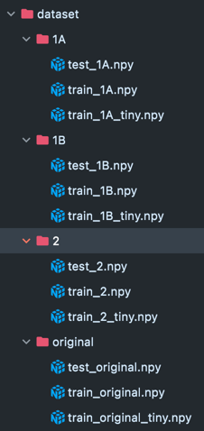

# Deep Learning project

---
```
Léon Bousquet - Damien Carrier - Arthur Duca - Clément Savinaud
INFRES 12
```

---

## Prérecquis

Installation de [docker](https://docs.docker.com/get-docker/) sur votre machine.

## Lancement du projet : 

* Lancement du container : `make up`
* Exécution du projet : `python app/main.py`
* Nettoyage du projet **(A faire uniquement en cas de netttoyage de fin)** : `make clear`

## Informations supplémentaire pour l'utilisation du projet :
À la racine du projet :
* Création d'un dossier dataset qui prendra la forme suivante :



* Création d'un dossier images qui permettra d'enregistrer les images si besoin. Ensuite décommenter la partie liée à l'enregistrement de ces images dans le fichier `app/utils.py`

Par la suite, vous pourrez utiliser les modèles déjà enregistrer dans `app/trained_model` si besoin pour tester nos résultats.